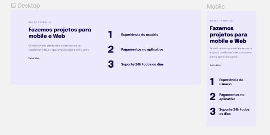

<h1 align="center"> Responsividade </h1>

Programa exclusivo do Explorer, promovido pela Rocketseat para ensino de tecnologias WEB.  

  <a href="#-tecnologias">Tecnologias</a>&nbsp;&nbsp;&nbsp;|&nbsp;&nbsp;&nbsp;
  <a href="#-projeto">Projeto</a>&nbsp;&nbsp;&nbsp;|&nbsp;&nbsp;&nbsp;
  <a href="#-layout">Layout</a>&nbsp;&nbsp;&nbsp;|&nbsp;&nbsp;&nbsp;
  <a href="#memo-licença">Licença</a>

  

 

  

## 🚀 Tecnologias

Esse projeto foi desenvolvido com as seguintes tecnologias:

- HTML e CSS
- Git e Github
- Figma

## 💻 Projeto

 É um projeto de responsividade, que faz com que o nosso site se adapte em diversas resoluções de tela.

- [Acesse o projeto finalizado, online](https://marcossantos1990.github.io/responsividade/)

## 🔖 Layout

Você pode visualizar o layout do projeto através [DESSE LINK](https://www.figma.com/file/yqm7kue9HRA7QxsXya6QsC/Explorer-Stage-03-Projeto-02-(Copy)?node-id=203%3A412&t=rqGQK19DE1Yhf7Oc-0).
## :memo: Licença

Esse projeto está sob a licença MIT.

---
